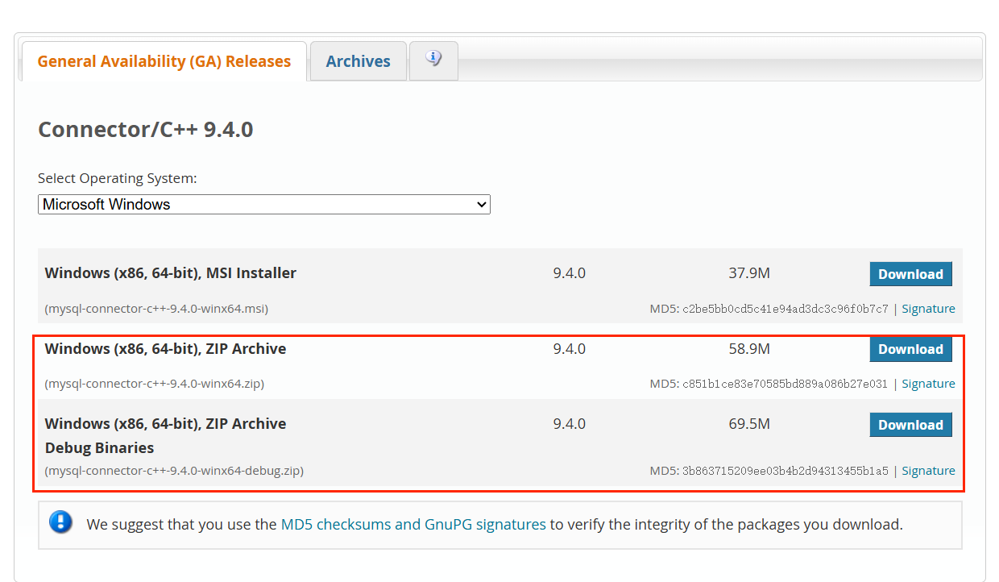
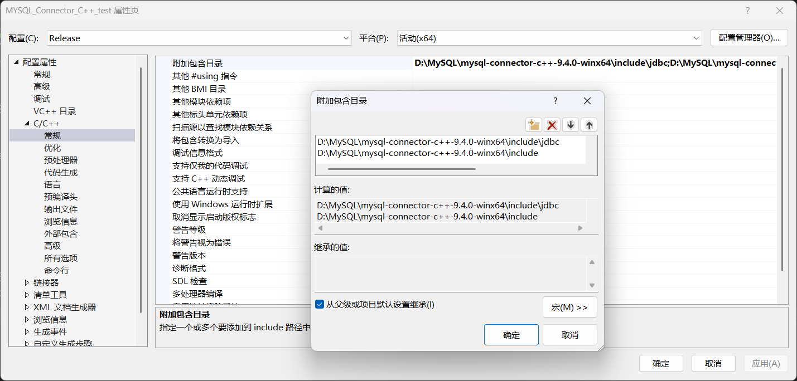
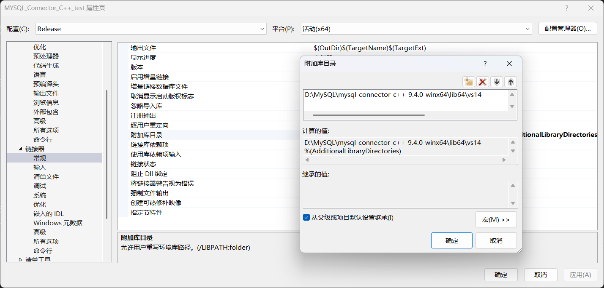
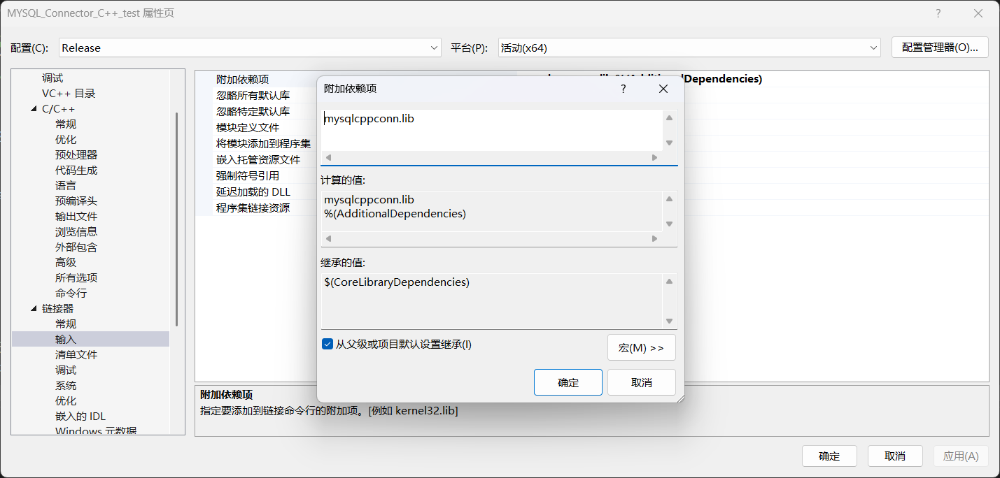
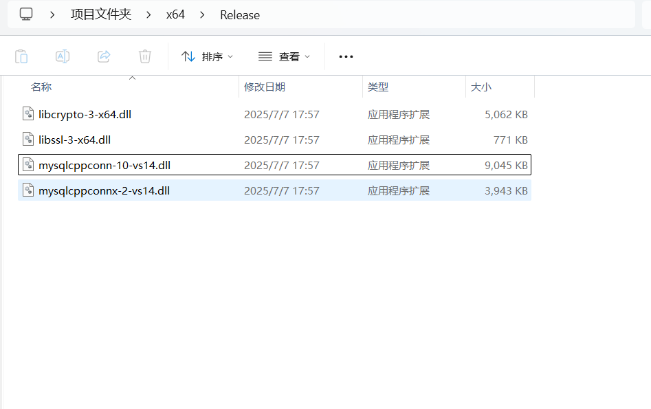

# StudentManager

简单的使用C++语言连接MYSQL数据库的学生管理系统

环境说明：

**IDE:Visual Studio** 2022

**数据库：MYSQL** 8.0.43

**数据库连接器：mysql-connector-c++-9.4.0-winx64**

需要在https://dev.mysql.com/downloads/connector/cpp/下载mysql-connector-c++,建议下载zip版本

（下面的是Debug版本，我用的是中间的Release版本）

在VS里配置项目属性

需要提前将以下文件放入  项目目录/x64/Release/ 里面，文件在…\mysql-connector-c++-9.4.0-winx64\lib64 里面

用 school.sql创建表，需要自己在main文件修改相关配置。

（还是隔壁java操作数据库方便点，C++太麻烦了）
